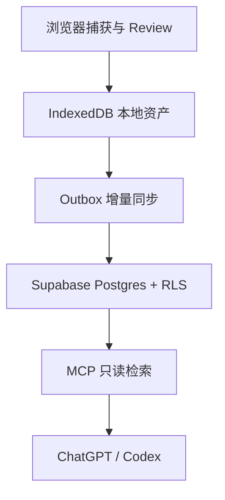

# AI Work Memory：Supabase 云同步与 MCP 扩展设计

> 文档状态：未来架构基线  
> 适用阶段：V0.2–V0.3  
> 当前版本：2026-08-25  
> 重要边界：本文不改变 V0.1 的 `Correction → Rule → Reuse` 验证范围，V0.1 仍保持无账号、无云同步、无 MCP。

## 一、结论

AI Work Memory 可以使用 Supabase 作为云端资产层，而且与当前技术方向匹配：

- Postgres：存储 Asset、Revision、Scope、SourceEvent、UsageEvent 和同步元数据。
- Supabase Auth：管理插件用户登录和会话。
- Row Level Security（RLS）：在数据库层隔离每个用户的资产。
- Edge Functions：承载同步 API、领域校验和可选 MCP Gateway。
- Storage：仅用于 JSON/Markdown 备份和未来附件，不作为 Rule 主数据库。
- Realtime：用于在线变更通知，但不替代离线同步、冲突检测和重试机制。
- OAuth 2.1 Server：未来可作为 ChatGPT/Codex 连接 MCP 的授权服务器，但该能力当前仍需按生产成熟度重新验证。

最终产品原则为：

> Local-first, optionally synced, universally accessible through MCP.

本地 IndexedDB 继续负责即时使用和离线能力；Supabase 提供可选的跨设备同步与远程 MCP 数据源；用户不登录时，插件的核心闭环仍应完整可用。

## 二、为什么选择 Supabase

### 2.1 适配当前数据形态

AI Work Memory 的核心数据不是大量原始文档，而是结构化、强关系、带版本的工作资产：

- 一个 Asset 对应多个不可变 Revision。
- Asset 需要唯一 canonical key、当前版本指针和状态。
- Rule 需要 Scope、来源证据和使用记录。
- 同步需要事务、唯一约束、幂等和乐观锁。

Postgres 比把所有内容存进 Google Drive JSON 文件更适合这些要求。

### 2.2 认证与数据隔离可形成闭环

Supabase Auth 使用 JWT，并可通过 RLS 把 `auth.uid()` 与业务表中的 `owner_id` 绑定。这样浏览器插件、同步 API 和未来 MCP 即使使用不同入口，数据库仍能执行同一套用户隔离规则。

### 2.3 MCP 认证方向基本对齐

OpenAI 的 MCP 认证规范要求私有用户数据和写操作使用 OAuth 2.1。Supabase 已提供 OAuth 2.1 Server、OIDC、PKCE 和动态客户端注册能力，并明确包含 MCP 场景。但正式发布前必须验证以下兼容点：

- Protected Resource Metadata。
- OAuth/OIDC Discovery。
- PKCE S256。
- Dynamic Client Registration 或预定义 Client。
- `resource` 参数和 token audience。
- ChatGPT/Codex 回调地址。
- Scope 与 RLS 的映射。

不能简单地把“插件登录 Supabase”直接等同于“ChatGPT 已能连接 MCP”。两者共用同一用户身份，但仍有两条授权链路。

## 三、目标总体架构

### 3.1 分层

| 层级 | 组件 | 职责 |
| --- | --- | --- |
| Capture Layer | Chrome/Edge Extension | 捕获选择文本、纠正和可选邻近证据 |
| Review Layer | Candidate Rule UI | 用户确认名称、Scope、内容和重复更新方式 |
| Local Asset Layer | IndexedDB | 离线工作、即时检索、本地历史和 Outbox |
| Sync Layer | Sync Engine + Edge Function | 增量推送、增量拉取、幂等、冲突和重试 |
| Cloud Asset Layer | Supabase Postgres | 跨设备资产、版本、变更序列和 RLS |
| Access Layer | Context Composer + MCP Server | 为插件、ChatGPT、Codex 提供可解释检索 |
| Backup Layer | JSON/Markdown + Storage/Drive | 可移植备份与用户数据所有权 |

### 3.2 数据流



核心约束：

1. 本地写入先成功，网络同步不得阻塞 Capture。
2. 云同步必须由用户主动开启。
3. MCP 默认只读，不能绕过 Review 直接写正式 Asset。
4. Local Repository、Cloud Repository 和 MCP 必须复用同一套领域规则。
5. 数据库、AI 平台和 UI 都不是资产所有者，用户才是。

## 四、认证设计

### 4.1 插件认证

V0.2 推荐支持：

1. Magic Link / Email OTP。
2. Google 登录作为可选入口。

浏览器扩展只保存短期 access token 和可轮换 refresh session；不能包含 service role key、数据库密码或 MCP client secret。

登录只控制云同步，不控制本地功能：

| 状态 | 本地 Capture/Library/Build Context | 云同步 | MCP |
| --- | --- | --- | --- |
| 未登录 | 可用 | 不可用 | 不可用 |
| 已登录未开启同步 | 可用 | 不上传 | 不可用 |
| 已登录并开启同步 | 可用 | 可用 | 可连接 |

### 4.2 MCP 认证

MCP 连接由 ChatGPT/Codex 发起，推荐采用：

```text
ChatGPT / Codex
→ MCP Protected Resource Metadata
→ Supabase OAuth 2.1 Authorization
→ 用户登录并同意 assets:read
→ Access Token
→ MCP Server 校验 token
→ 使用用户身份访问 RLS 数据
```

第一版 Scope：

```text
assets:read
context:build
```

后续才考虑：

```text
candidates:write
```

不应提供 `assets:write` 让 AI 直接修改正式资产。

### 4.3 RLS 基线

所有用户数据表必须包含 `owner_id uuid not null`，并分别定义 SELECT、INSERT、UPDATE、DELETE policy。基本规则：

```sql
using ((select auth.uid()) = owner_id)
with check ((select auth.uid()) = owner_id)
```

还必须：

- 为 `owner_id` 建索引。
- 禁止匿名用户访问资产表。
- service role 只存在于受控服务端。
- 同步与 MCP 正常路径尽量携带用户 token，让 RLS 生效。
- 管理任务如确需绕过 RLS，必须独立审计。

## 五、云端数据模型

### 5.1 assets

| 字段 | 类型 | 说明 |
| --- | --- | --- |
| id | uuid PK | 跨设备稳定 Asset ID，由客户端生成 |
| owner_id | uuid FK | 所属用户 |
| kind | text | V0.2 仍只允许 rule |
| name | text | Rule 名称 |
| status | text | active / archived |
| scope_level | text | global / task / project / custom |
| scope_key | text nullable | 稳定 Scope key |
| scope_label | text nullable | 展示名称 |
| applies_when | text nullable | 人类可读适用条件 |
| tags | text[] | 简单标签 |
| canonical_key | text | 同用户去重键 |
| current_revision_id | uuid | 当前 Revision |
| usage_count | bigint | 可重算的使用计数 |
| last_used_at | timestamptz | 最近使用时间 |
| entity_version | bigint | 乐观锁版本 |
| created_at | timestamptz | 创建时间 |
| updated_at | timestamptz | 服务端更新时间 |
| deleted_at | timestamptz nullable | Tombstone，不立即物理删除 |

关键约束：

- `unique(owner_id, canonical_key)` 对未删除记录生效。
- `current_revision_id` 必须属于同一 Asset。
- `entity_version` 每次可变字段更新时递增。

### 5.2 asset_revisions

Revision 原则上不可变：

| 字段 | 说明 |
| --- | --- |
| id | 客户端生成 UUID |
| owner_id | RLS 隔离和查询优化 |
| asset_id | 所属 Asset |
| version | 资产内递增版本 |
| content | Rule 正文 |
| change_reason | 修改原因 |
| supersedes_revision_id | 上一版本 |
| created_by_device_id | 来源设备 |
| created_at | 创建时间 |

约束：`unique(asset_id, version)`。

### 5.3 source_events

默认只同步最小证据：

- event_type。
- platform。
- user_text。
- captured_at。
- retention_mode。

默认不同步：

- 完整聊天。
- AI 全量回答。
- 网页正文。
- URL，除非用户开启“同步来源链接”。

建议将 retention mode 扩展为：

```text
local_only
sync_minimal
sync_with_evidence
```

### 5.4 usage_events

UsageEvent 采用 append-only，记录：

- retrieved。
- included。
- excluded。
- copied。

它用于评估 Rule Reuse Rate，而不是制作 Dashboard。可定期聚合到 Asset 的 usage_count，原始记录可以设置保留期限。

### 5.5 devices、sync_changes 与 sync_conflicts

`devices`：保存用户设备身份、最后同步时间和撤销状态。

`sync_changes`：服务端全局递增 `sequence`，记录 owner、entity type、entity id、operation 和时间。客户端使用 `last_server_sequence` 增量拉取，避免依赖客户端时间戳。

`sync_conflicts`：只保存需要用户处理的冲突，不能静默覆盖 Rule 内容。

## 六、同步协议

### 6.1 本地 Outbox

IndexedDB 新增：

```text
sync_outbox
sync_state
sync_conflicts
```

每次本地修改：

1. 在同一 IndexedDB transaction 中写业务数据和 Outbox。
2. UI 立即返回成功。
3. 后台任务批量 push。
4. 成功后移除 Outbox；失败指数退避。

每个 mutation 包含：

```text
mutation_id
device_id
entity_type
entity_id
operation
base_entity_version
payload
created_at
```

服务端必须使用 `mutation_id` 幂等，重复请求不能创建重复 Revision。

### 6.2 Pull

客户端保存：

```text
last_server_sequence
```

拉取：

```text
GET changes?after=<sequence>&limit=...
```

响应包含变更、删除 Tombstone 和新 cursor。Realtime 只负责提示“可能有更新”，最终一致性仍以 Pull 为准。

### 6.3 冲突策略

| 场景 | 策略 |
| --- | --- |
| 两台设备新建相同 canonical_key | 标记 Possible Duplicate，用户合并 |
| 同一 Rule 并发修改 | 双方 Revision 都保留，当前版本需用户确认 |
| 设备 A Archive、设备 B 编辑 | 保留新 Revision，资产保持 archived 并提示恢复/保留归档 |
| UsageEvent 重复上传 | mutation_id 去重 |
| 删除后旧设备回传 | Tombstone 优先，不允许静默复活 |

禁止对 Rule Content 使用简单 Last Write Wins。

## 七、API 与服务边界

### 7.1 插件同步 API

建议通过 Edge Functions/服务 API 完成领域写入，而不是让 UI 任意直接更新多张表：

```text
POST /sync/push
GET  /sync/pull
POST /sync/bootstrap
POST /sync/resolve-conflict
GET  /account/export
DELETE /account/data
```

只读列表可以直接使用 RLS PostgREST，但为保持本地与云端行为一致，V0.2 推荐逐步集中到 Sync/Domain Service。

### 7.2 MCP Tools

V0.2 只读工具：

```text
search_rules(query, task?, project?, scope?, limit?)
get_rule(asset_id)
build_context(task, current_input, project?)
list_scopes(level?)
```

返回结果必须包含：

- current revision content。
- scope。
- score。
- why matched。
- version。
- updated_at。

V0.3 可增加：

```text
create_rule_candidate(source, correction, suggested_scope?)
suggest_rule_update(asset_id, correction)
```

这些工具只写 Candidate Queue，不能直接更新 Asset。

### 7.3 MCP 部署选择

Supabase Edge Functions 可用于原型 MCP Gateway，因为它提供 HTTPS、TypeScript、JWT 校验和数据库访问。正式决定前应验证：

- Streamable HTTP transport。
- 长连接与超时限制。
- OAuth metadata 路由。
- SDK 在 Deno/Edge Runtime 的兼容性。
- 冷启动、日志和限流。

如果这些能力不满足，MCP Server 可独立部署，只把 Supabase 作为 Postgres/Auth。不要让数据层选择锁死 MCP 运行时。

## 八、检索策略

V0.2 仍坚持 Precision > Recall，不引入 Vector DB。

推荐复用 V0.1 评分：

```text
5 × exact_scope_match
+ 3 × parent_scope_match
+ 0..3 × keyword_overlap
+ 0..2 × tag_match
+ 0..1 × previous_included
- 5 × scope_conflict
```

本地和云端必须输出同样的 `why matched`。可以使用 Postgres Full Text Search 或 trigram 作为关键词候选生成，但最终排序逻辑要可解释、可测试。

Embedding 只有在以下条件同时满足时再评估：

1. Rule 数量和语言差异使关键词明显漏召回。
2. Retrieved → Included Rate 没有因扩大召回下降。
3. 可以解释语义命中的理由。

## 九、隐私和安全

### 9.1 默认策略

- 云同步默认关闭。
- 首次开启前展示同步字段清单。
- 不同步完整聊天。
- Source URL 默认仅本地。
- MCP 默认只读。
- 用户可以导出全部数据。
- 用户可以断开 MCP、撤销设备和删除云端数据。

### 9.2 E2EE 边界

完全端到端加密与服务端 MCP 检索存在直接冲突：如果服务端不能解密 Rule，MCP 就无法检索和返回内容。

V0.2 建议采用：

- HTTPS 传输。
- Supabase 平台静态加密能力。
- RLS 用户隔离。
- 最小化同步证据。
- 可选敏感内容不上传。

不要在没有完整密钥恢复、设备撤销和 MCP 解密设计前宣称 E2EE。

### 9.3 Secret 管理

- Extension 只使用 publishable key 和用户 session。
- service role key 仅限 Edge Function/受控服务端。
- OAuth/MCP secrets 进入服务端 secret store。
- 日志不得记录 Rule 正文、token、source URL 或 Current Input。

## 十、代码结构演进

当前仓库不需要立即改成 Monorepo。V0.2 开始时建议演进为：

```text
apps/
  extension/

packages/
  domain/             # Asset、Revision、Scope、检索、Composer
  sync-contracts/     # Push/Pull DTO、冲突类型

supabase/
  migrations/
  functions/
    sync-push/
    sync-pull/
    account-export/
    mcp/
```

迁移原则：

1. 先把 `src/core` 中纯 TypeScript 领域逻辑抽为 package。
2. UI 继续通过 AssetService，不直接访问 Supabase。
3. Local Repository 和 Cloud Sync Adapter 实现同一套 port。
4. Edge Function 和 MCP 复用 domain 包，避免两套检索算法漂移。

## 十一、版本路线

### V0.1：本地核心闭环

保持原范围：

```text
Correction → Review → Local Rule → Retrieve → Copy Context
```

成功条件：用户确实保存并复用 Rule。

### V0.2：可选 Supabase Sync + 只读 MCP Alpha

范围：

- Supabase Auth。
- Postgres + RLS。
- Local Outbox。
- Push/Pull 和 Tombstone。
- 单用户多设备同步。
- JSON/Markdown 云备份。
- 只读 MCP Tools。

明确不做：团队、共享资产、Billing、写入正式 Asset、Vector Search。

### V0.3：MCP Beta

范围：

- OAuth 2.1 production hardening。
- ChatGPT/Codex 正式连接。
- Candidate Write Tools。
- 设备与授权管理。
- 审计和限流。

### V1.0：基于验证结果决定

只有 Rule Reuse Rate 和 MCP Included Rate 得到验证后，才评估团队、共享、更多 Asset Kind 或商业化。

## 十二、验收指标

### 产品指标

- 开启同步用户的跨设备成功率。
- Rule Reuse Rate。
- MCP Retrieved → Included Rate。
- Duplicate Correction Rate。
- 用户手动解决冲突的比例。

### 技术 SLO 建议

- 本地 Capture 写入不依赖网络。
- 同步请求重复执行不产生重复数据。
- 断网恢复后最终一致。
- 任意用户无法通过客户端绕过 RLS 读取其他用户数据。
- MCP 只返回调用用户的 active current revisions。
- Archive/Delete 在旧设备重新上线后不会复活。

## 十三、关键风险与决策

| 风险 | 判断 | 应对 |
| --- | --- | --- |
| 过早扩大 V0.1 | 高 | 设计保留，但不进入 V0.1 实现 |
| Supabase OAuth 2.1 成熟度 | 中 | 当前为公开 Beta，正式发布前复测 |
| Realtime 被误当同步 | 高 | Realtime 仅通知，Pull cursor 才是最终一致性 |
| RLS 配置错误 | 高 | 每张表逐操作 policy + 自动化越权测试 |
| MCP 绕过 Review | 高 | 只读优先；写操作只创建 Candidate |
| Source 泄露敏感信息 | 高 | 最小同步、URL 默认本地、日志脱敏 |
| 双端检索逻辑漂移 | 中 | 共享 domain package 与契约测试 |
| Edge Functions 不适合 MCP transport | 中 | MCP runtime 与 Supabase 数据层解耦 |

## 十四、最终设计决策

1. **采用 Supabase 作为 V0.2 候选云端数据层。**
2. **IndexedDB 继续保留，产品定位从 Local-only 调整为 Local-first。**
3. **Google Drive/Dropbox 只作为备份出口，不作为主数据库。**
4. **V0.1 不增加登录、同步和 MCP，避免破坏核心假设验证。**
5. **V0.2 先做可选同步和只读 MCP，不允许 AI 直接写正式 Asset。**
6. **Supabase Auth 负责用户身份；RLS 是数据隔离的最后防线。**
7. **Supabase OAuth 2.1 Server 可用于 MCP 授权，但生产前必须验证 OpenAI 所需的完整授权契约。**
8. **Realtime 只做变更提示，Outbox + Change Sequence + Pull 才构成可靠同步。**
9. **MCP runtime 与 Supabase 数据层解耦，Edge Functions 可先原型验证。**
10. **不引入 Vector DB，继续优先可解释、精确的 Rule Retrieval。**

## 参考资料

- [Supabase Documentation](https://supabase.com/docs)
- [Supabase Auth](https://supabase.com/docs/guides/auth)
- [Supabase OAuth 2.1 Server](https://supabase.com/docs/guides/auth/oauth-server)
- [Supabase Row Level Security](https://supabase.com/docs/guides/database/postgres/row-level-security)
- [Supabase Edge Functions](https://supabase.com/docs/guides/functions)
- [OpenAI MCP Server](https://developers.openai.com/plugins/concepts/mcp-server)
- [OpenAI MCP Authentication](https://developers.openai.com/plugins/build/auth)

